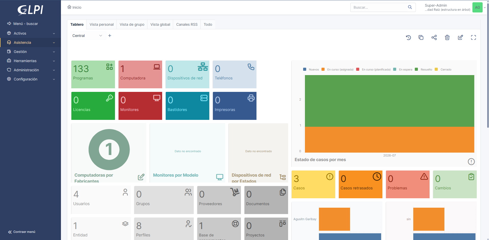
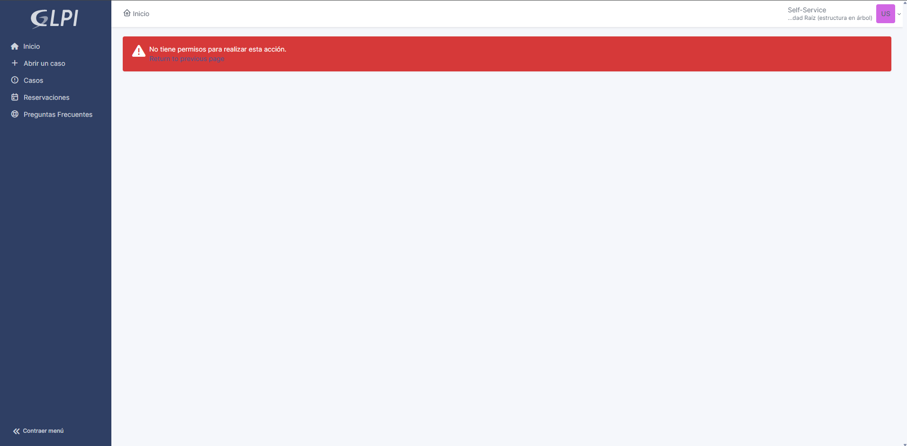
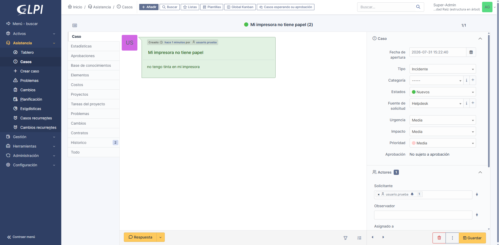
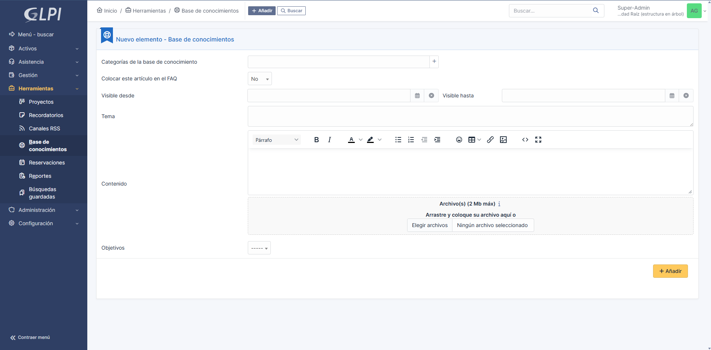
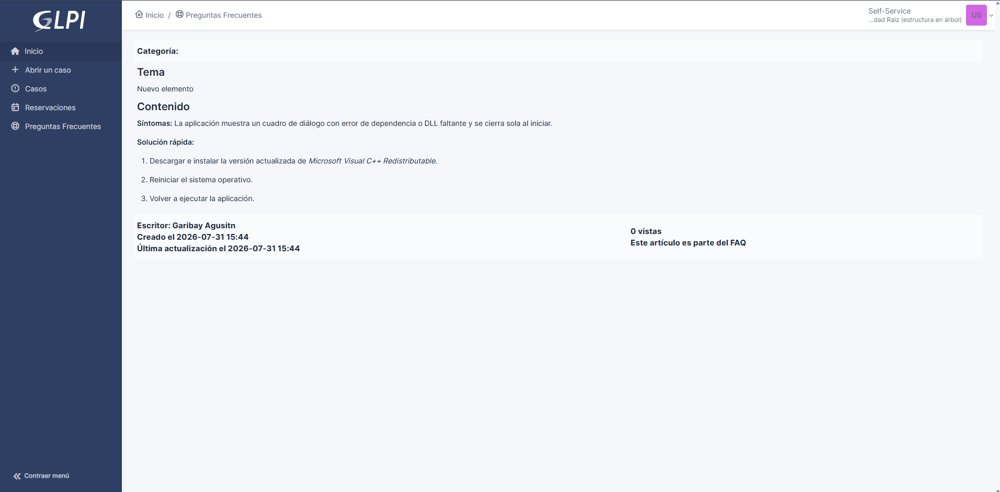
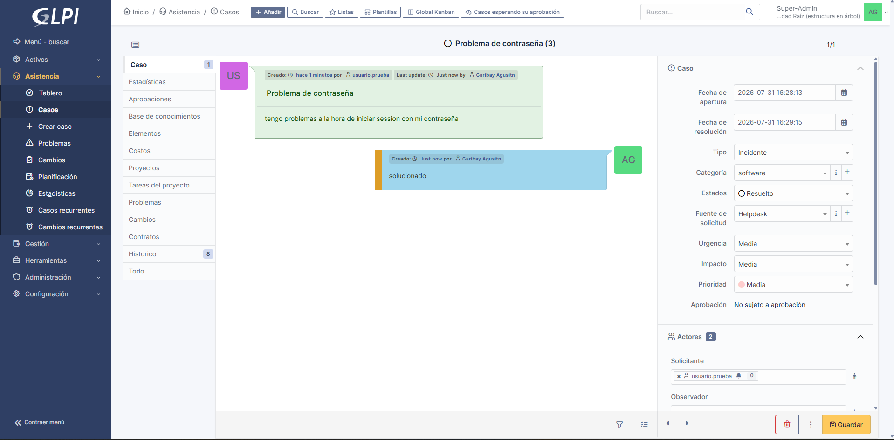

# laboratorio-glpi-itsm
Implementación de solución ITSM en GLPI con RBAC, FAQ y Automatización.

# Laboratorio GLPI: Mesa de Ayuda y Automatización

Monté GLPI en un servidor local (`192.168.1.128`) para armar un entorno de prueba de mesa de ayuda. La idea con este laboratorio fue simular cómo se gestionan las incidencias en una red corporativa: ajustar los permisos de los usuarios para aplicar el principio de mínimo privilegio, armar artículos en la base de conocimientos y dejar configurada la asignación automática de tickets según el problema.

---

## 1. Separación de Perfiles (RBAC)

Para probar el control de accesos, creé un usuario de prueba (`usuario.prueba`) asignado al perfil **Self-Service**. La idea era simular el rol de un empleado común de la organización, asegurándome de que solo pueda reportar problemas y leer la base de conocimientos, sin acceso a la parte de infraestructura ni a las configuraciones del sistema.

* **Vista restringida del usuario:**

* **Vista desde mi cuenta de administración (Super-Admin):**

---

## 2. Base de Conocimiento (FAQ)

Para evitar que los usuarios abran tickets por fallos sencillos o repetitivos, armé una solución rápida en la sección de Preguntas Frecuentes. Escribí un artículo corto sobre cómo resolver un error típico de dependencias en aplicaciones para que cualquier usuario pueda consultarlo antes de mandar un reporte.

* **Creación del artículo desde el panel de administración:**

* **Vista del artículo publicado para el usuario en la sección de FAQ:**

---

## 3. Asignación Automática de Tickets

Para no tener que revisar y asignar manualmente cada ticket que ingresa, armé una regla de negocio. La lógica que configuré fue simple: si un ticket entra clasificado en la categoría `software`, GLPI lo asigna automáticamente a mi usuario técnico (`Garibay Agustin`).

* **Configuración de la regla y la acción en el sistema:**

* **Prueba de la regla:** Para comprobar que funcionaba, entré desde una ventana de incógnito con la cuenta de `usuario.prueba`, creé un ticket con la categoría `software` y verifiqué que el sistema lo asignara solo a mi cuenta.

